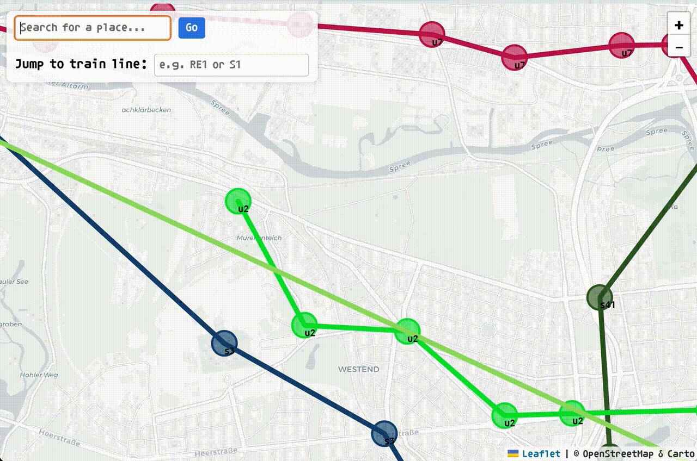

# Visual Train Route

Bring train route onto the map.

## Pre-Run (Optional)

You can regenerate all Berlin station geocodes by running the following script.

```sh
go run scripts/clean.go
```

It will read CSV files from `data/stations-berlin`, apply geocoding, and write the output into `data/berlin.csv`

> NOTE: Some S3 train stations have geolocations messed up with geocoder service, and I have `data/berlin.csv` already corrected by hand.

## Run

Run an application with go

```sh
go run main.go
```

Then access the URL `http://127.0.0.1:3000/` in your browser.




